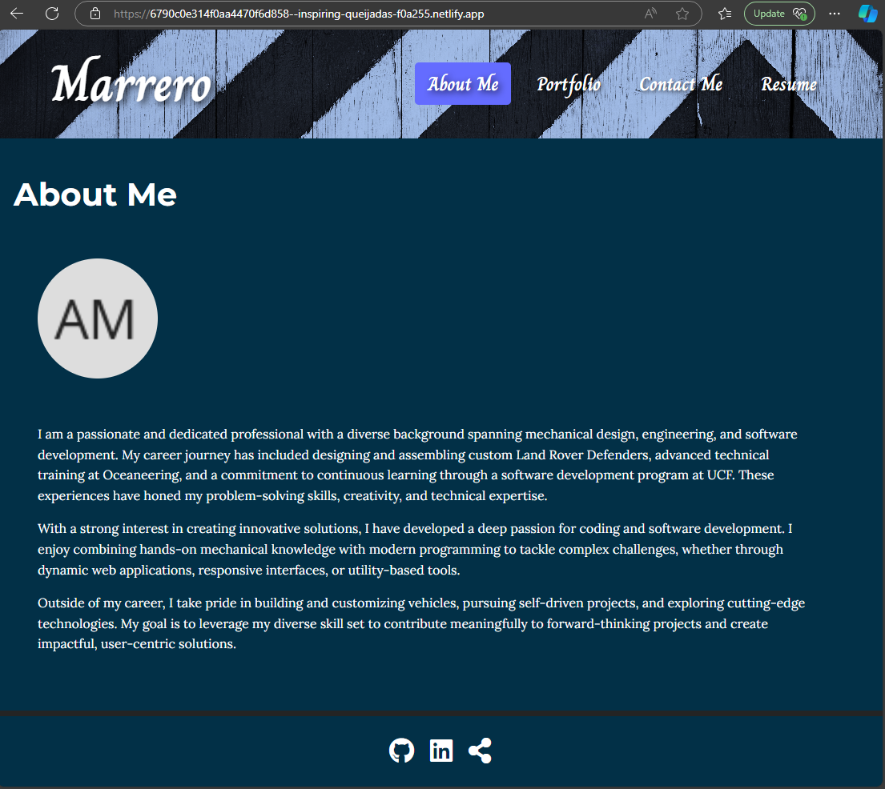
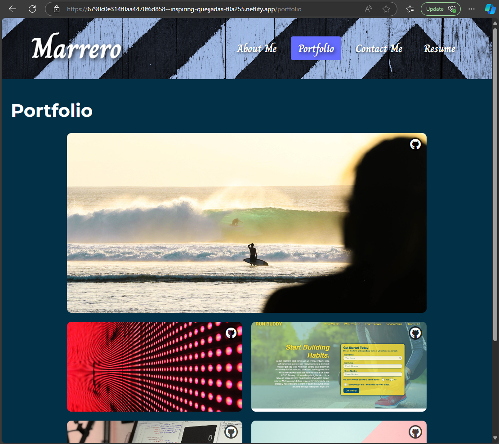
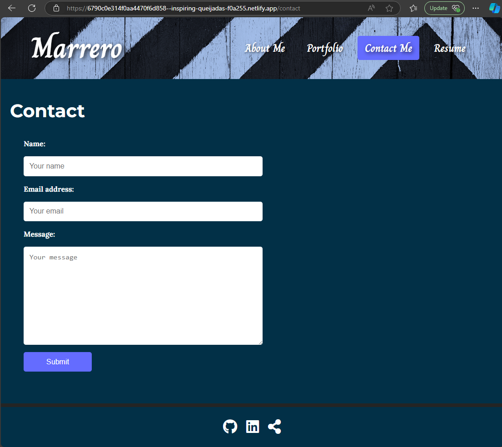
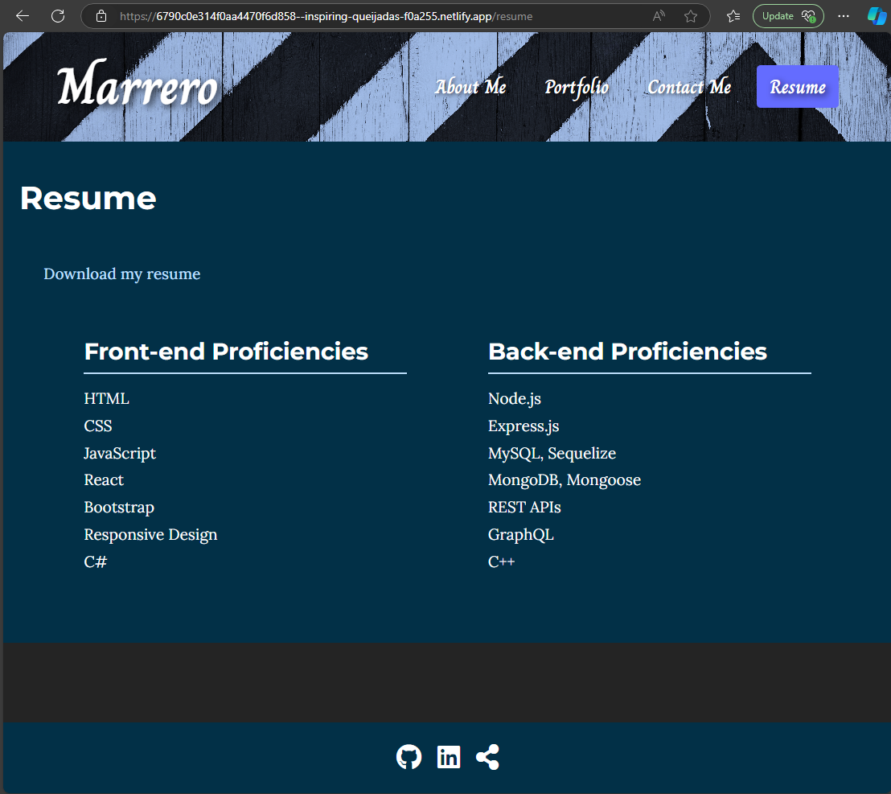

# DeveloperStyleResume-DSR

DevResume is a React-based portfolio application designed to showcase personal skills, projects, and professional experience in a clean and interactive format. This application features multiple sections, including "About Me," "Portfolio," "Contact," and "Resume," making it an excellent choice for presenting your professional profile online.

---

## Features

### **About Me**
- Brief introduction with a profile avatar.
- Background information to give viewers insight into your professional journey.

### **Portfolio**
- Interactive grid of project cards showcasing completed work.
- Featured project that spans two columns for emphasis.
- GitHub links on each card for easy access to repositories.

### **Contact**
- Functional contact form with email validation.
- User-friendly interface for inquiries.

### **Resume**
- Front-end and back-end proficiencies listed.
- Downloadable PDF resume.

---

## Technologies Used

- **React**: Core framework for building the application.
- **React Router DOM**: For seamless navigation between pages.
- **CSS**: Custom styling for a polished and professional look.
- **Font Awesome**: Icons for GitHub, LinkedIn, and other links.
- **Netlify**: Deployment platform for live hosting.

---

## Installation

To run this project locally:

1. Clone the repository:
   ```bash
   git clone https://github.com/Amarrero0215/DeveloperStyleResume-DSR.git
   ```

2. Navigate to the project directory:
   ```bash
   cd DevResume
   ```

3. Install dependencies:
   ```bash
   npm install
   ```

4. Start the development server:
   ```bash
   npm run dev
   ```

5. Open your browser and navigate to:
   ```
   http://localhost:5173/
   ```

---

## Deployment

The application is live and accessible at:
[Netlify Deployment URL](https://6790c0e314f0aa4470f6d858--inspiring-queijadas-f0a255.netlify.app/)

---

## Screenshots

### **About Me Section**


### **Portfolio Section**


### **Contact Section**


### **Resume Section**


*(Replace `#` with actual image paths or links)*

---

## License

This project is licensed under the MIT License - see the [LICENSE](LICENSE) file for details.

---

## Contributing

Contributions are welcome! Please follow these steps:
1. Fork the repository.
2. Create a new branch for your feature:
   ```bash
   git checkout -b feature-name
   ```
3. Commit your changes:
   ```bash
   git commit -m "Add feature-name"
   ```
4. Push the branch:
   ```bash
   git push origin feature-name
   ```
5. Create a pull request.

---

## Contact

Created by Alex Marrero. Feel free to connect:

- [GitHubProfile](https://github.com/Amarrero0215)
- [GitHubProject](https://github.com/Amarrero0215/DeveloperStyleResume-DSR)
